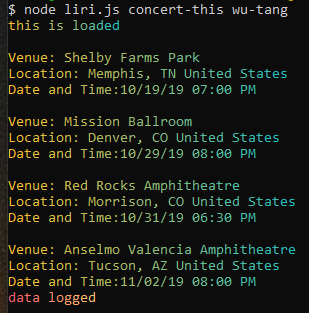
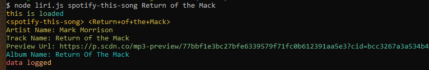
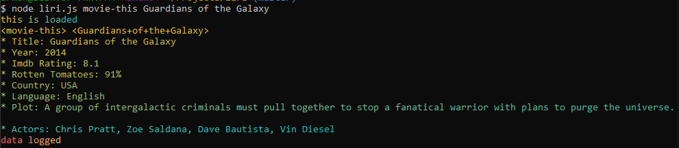
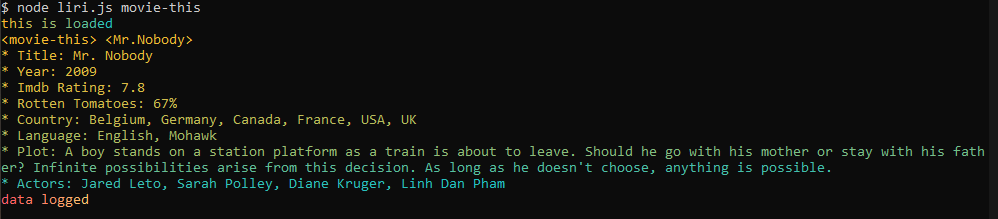
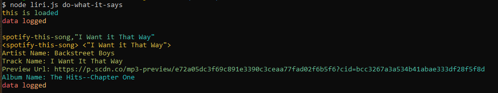
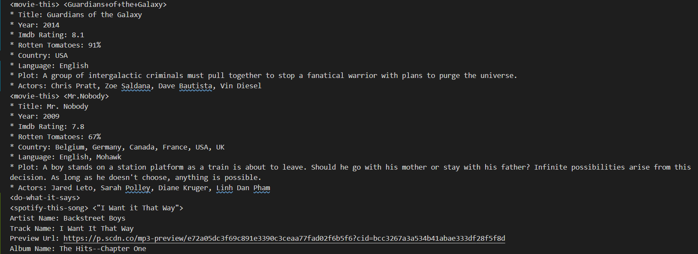

# Liri

### Node.js Homework

## In this assignment, you will make LIRI. LIRI is like iPhone's SIRI. However, while SIRI is a Speech Interpretation and Recognition Interface, LIRI is a Language Interpretation and Recognition Interface. LIRI will be a command line node app that takes in parameters and gives you back data.

### Technologies Used
    - Node.js
    - Gradient-string
    - Node-spotify-api
    - Moment.js
    - Axios
    - Bands in Town API
    - Omdb API
    - Chalk
    - ESlint Syntax

Commands | Description
---------| -----------
concert-this | Source Bands In Town API for event dates.
spotify-this-song | Source Spotify for information about a specific song.
movie-this | Source Omdb API for information about a certain movie. Leave blank for ***Mr. Nobody***.
do-what-it-says | Read random.txt file and complete task in file.

## All data is logged in log.txt

## Demo Pics

### Early versions of the app were very promising

### But eventually proved to be problematic

### concert-this Wu-Tang

### spotify-this-song ***Triumph***

### movie-this ***Guardians of the Galaxy***

### movie-this when left blank - ***Mr. Nobody***

### do-what-it-says

### log file
